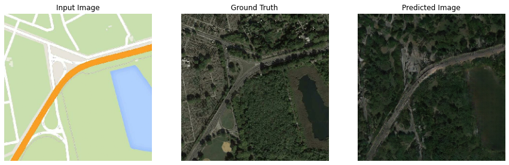
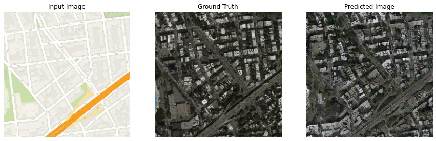
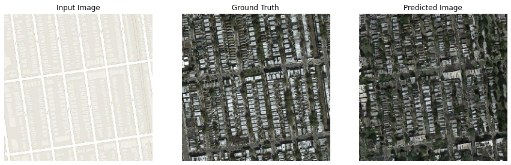
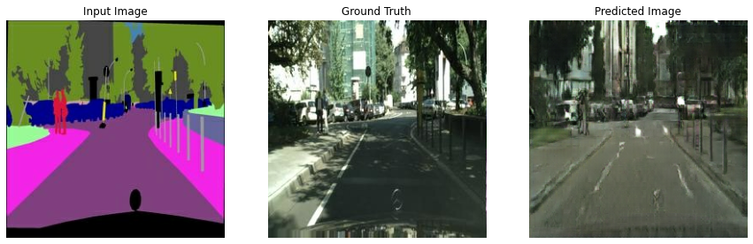
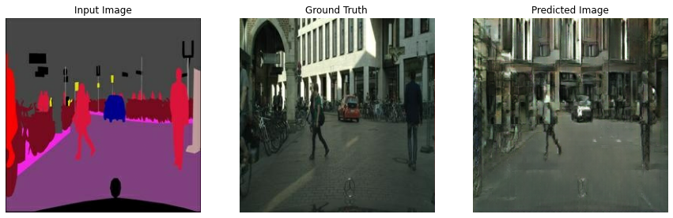
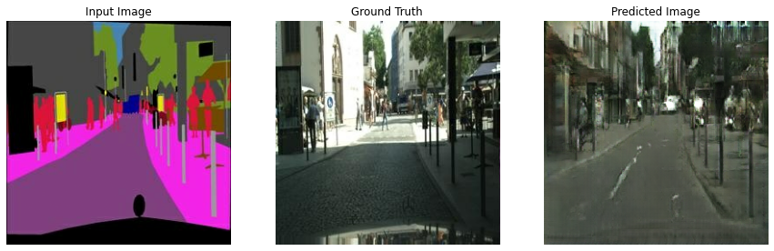

# Pix2Pix

A tensorflow v2.3.0 implementation of [Pix2Pix](https://arxiv.org/abs/1611.07004).

The models were trained on the cityscapes and maps datasets [(found here)](https://people.eecs.berkeley.edu/~tinghuiz/projects/pix2pix/datasets/) for 200 epochs each and batch sizes of 10 and 1 respectively.

## Outputs at 200 epochs:

### Maps:





### Cityscapes:
 
 
 

 The model did noticeably better at the maps dataset which can be attributed to it having a simpler output distribution vs the cityscapes dataset.

## Usage:

> python train.py [-i img_path] [-o out_path] [-c ckpt_path] [-e epochs] [-l learning_rate] [-b batch_size] [--cont]

-  -i: Path to dataset directory(default: ./data/maps/). Directory structure:
```
.
+-- dataset
|   +-- train
|   |   +--image1.png
|   |   +--image2.png
|   +-- val
|   |   +--image1.png
|   |   +--image2.png
|   +-- out
```
- -o: Path to output directory(default: ./data/maps/out/).
- -c: Path to checkpoint directory(default: ./data/ckpt).
- -e: Number of epochs as integer(default: 200).
- -l: Learning rate as float(default: 0.0002)
- -b: Batch size in integer(default: 1).
- --cont: Flag for continuing training. Training will start from scratch unless included.